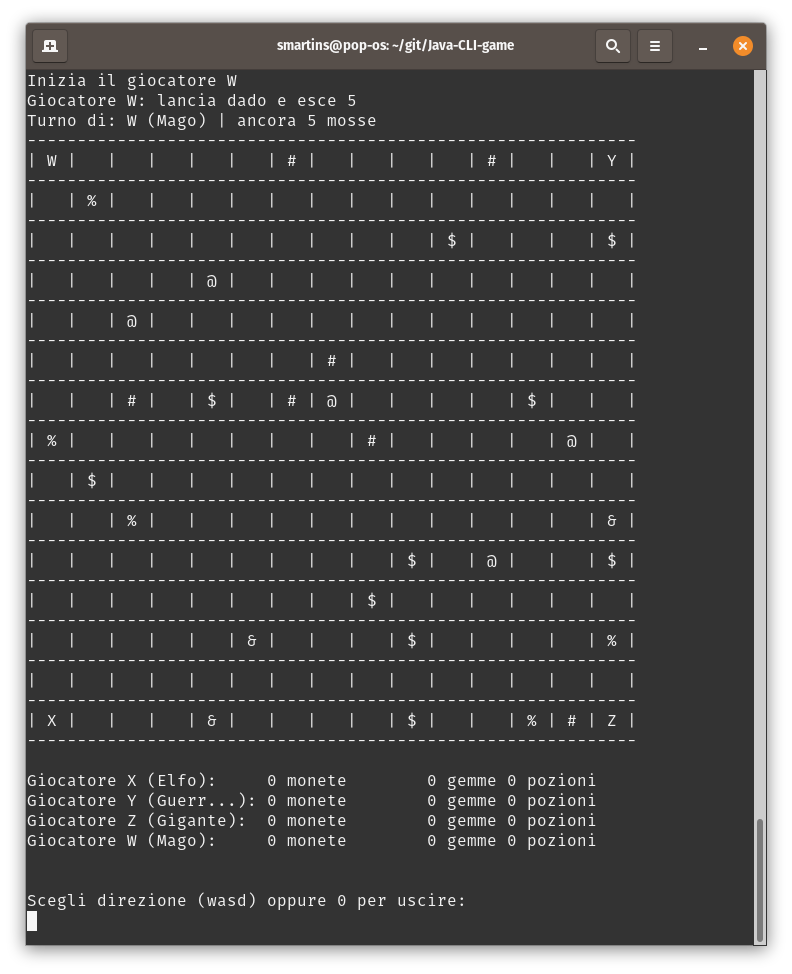

# Java CLI game
CLI Java game at turns RPG-like

## Table of contents
* [General Info](#general-info)
* [Screenshots](#screenshots)
* [Rules](#rules)
* [Setup](#setup)

## General Info
The objective of the game is gather all the money, if a player loses a fight against other player then he loses a money. If a player has no money and loses a fight is out. If a player gather all the money wins. The movements and the fight are decided by rolling a dice. Some classes have more speed and others are stronger in fights.

## Screenshots

  

 
 
## Rules
Players:
* X: player 1
* Y: player 2
* Z: player 3
* W: player 4

Objects:
* %: gems - you can avoid a fight
* &: potions - you can automatically win a fight
* $: money

Obstacles:
* @: rocks - you shall not pass
* #: trees - you need 2 turns to surpass this obstacle if you have enough magic

Classes for players:
* Elf: fastest class
* Warrior: avarege calss
* Mage: weakest calss, class with most magic
* Giant: slowest class, strongest class, weakest magic
 
## Setup
The main file is on `/src/ch/supsi/game/test/TestGame.java`

License
----

MPL-2.0 © Samuel Martins

